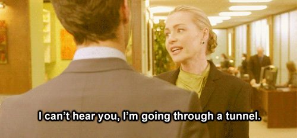
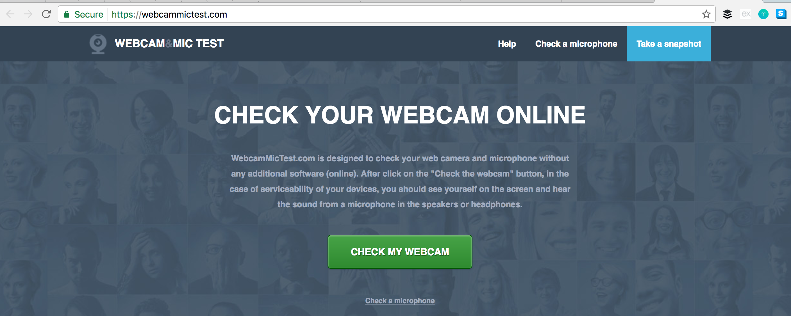
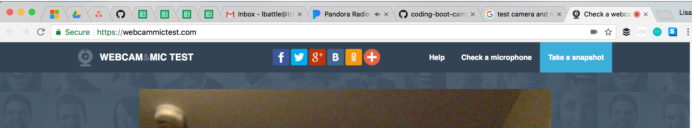
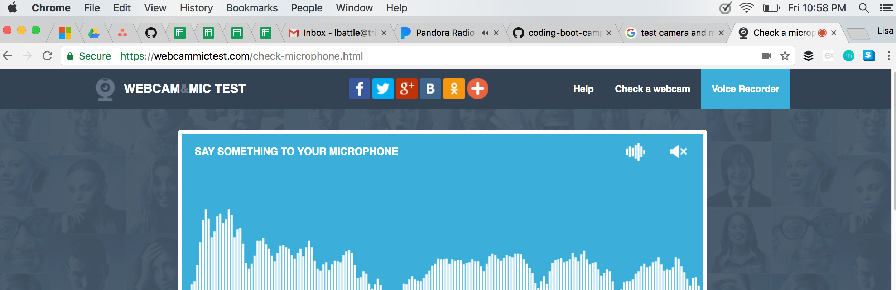
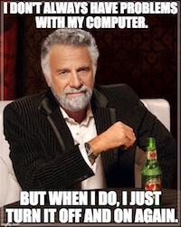
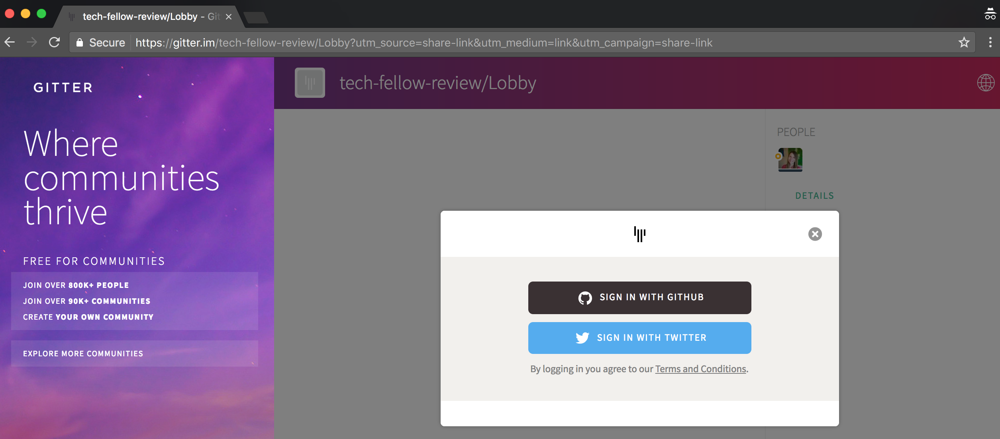

## Getting Started

### What are we covering today?

* Camera & Mic
* Gitter

### Camera & Mic

`Note: use memes liberally`

The experience of the session __is killer__ if you have a camera and microphone. If we can't see and hear you, it makes it a __little less fun__.

If you have a camera or microphone, take the time to __get them ready for the session__.

`Note: make it easy for them to succeed on installs`

[Click here](https://webcammictest.com/) to check your camera and microphone before the session!

Click the green "Check my Webcam" button.

__Note__: You'll may have to allow use of your camera by your browser to test.

__Next__, click "Check your microphone"

Click the green "Check my microphone" button.

__Note__: You'll may have to allow use of your camera by your browser to test.

If you see something like this - you're set!

__Note__: If you run into issues, just scroll down, you'll see troubleshooting steps below.

Always remember, there's nothing like a __good restart__...

### Gitter

`Note: use screenshots liberally`

Gitter is a tool we'll use to communicate with you throughout the lesson.

[Click here](https://www.google.com) when you start your session to sign into the chat with Github!

Make sure you're signed in at the beginning of the session!